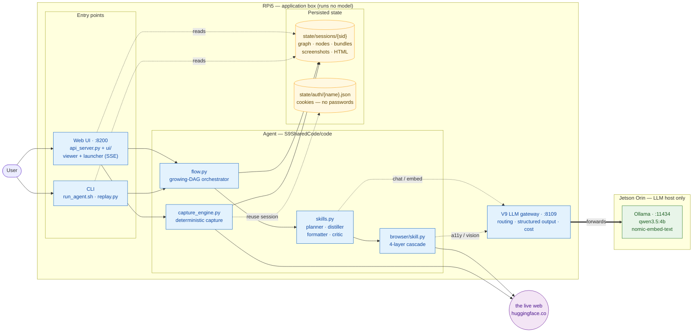
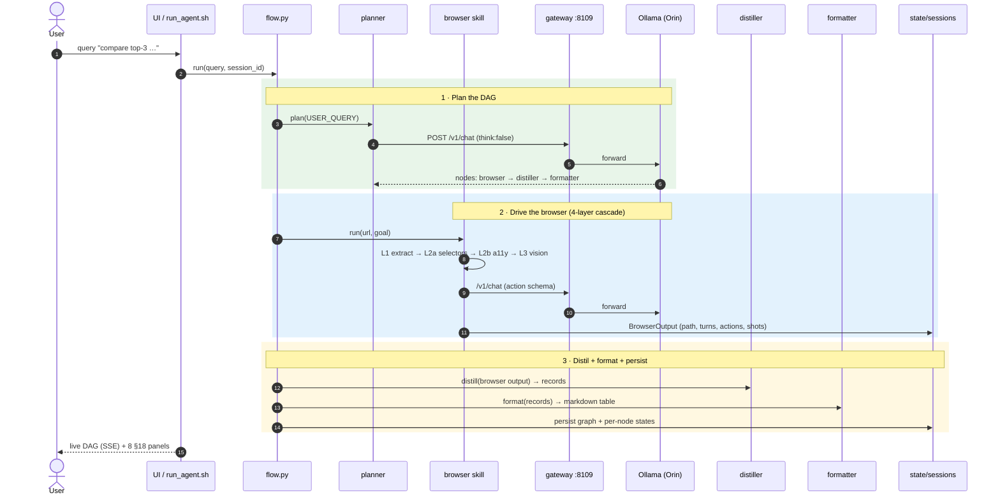
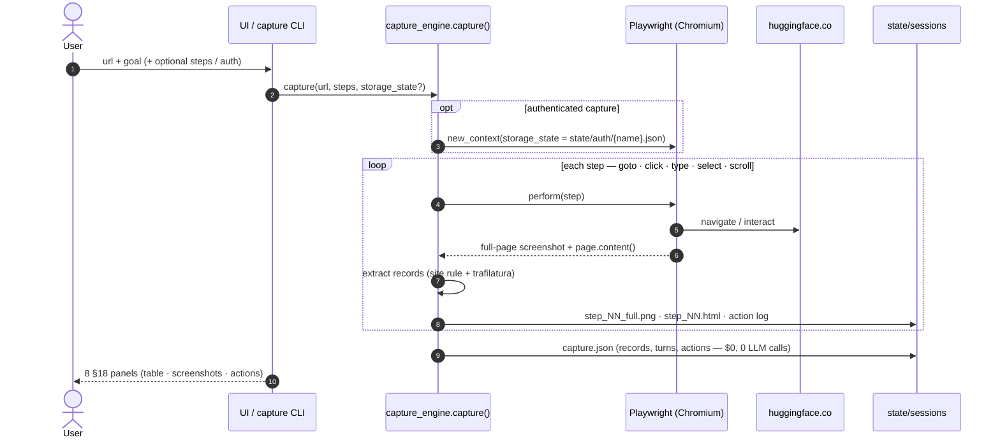

# RAXON — Browser Comparison Agent + Replay/Observation Terminal

A browser-capable multi-agent system that completes a **live web comparison task**
("Compare the top 3 most-liked Hugging Face text-generation models that use the
transformers library — name, parameter count, likes, one-line description") and
renders a full **replay / observation view** over the run.

It is built to the **BrowserAgent.pdf §18** brief: one agent that (a) drives a
real browser to extract listed/filtered/sorted data, and (b) produces a replay
covering eight criteria — user goal, planner DAG, browser path, ≥3 visible
actions, screenshots, extracted data, comparison table, and a turns + cost
summary.

Two ways to fulfil the task:

- **DAG run (LLM-planned)** — `planner → browser → distiller → formatter`,
  orchestrated by an immutable growing-DAG engine (`flow.py`).
- **Deterministic capture (no LLM clicks)** — a robust capture engine that
  navigates and extracts complete UI data (full-page screenshot + DOM + records
  + action log) without asking a model to choose clicks. This is what makes the
  task reliable on a small local model and what powers authenticated capture.

Both feed the same persisted session store, so the **web UI** and the **CLI
replay** render DAG runs and capture bundles identically.

---

## Demo video

▶ **[Watch the 1:14 demo on YouTube](https://www.youtube.com/watch?v=VIDEO_ID)** —
the live browser run (filter → sort by likes → open the top model) followed by a
walkthrough of all eight §18 replay panels.

Re-record after new runs: `scripts/record_demo.py` (Playwright video + captions,
UI on `:8200`) then `demo/make_video.sh` (ffmpeg → 720p H.264 mp4). Upload
title/description/chapters live in `demo/YOUTUBE.md`.

---

## Highlights

- **Two-host split** — the LLM runs on a Jetson **Orin** (Ollama); the **RPi5**
  is app-only (agent + a gateway that *forwards* to the Orin). The app box never
  runs a model.
- **V9 LLM gateway** (`:8109`) — provider routing, structured output, per-agent
  cost rollup; forwards chat/embeds/vision to the Orin.
- **Deterministic UI capture** — `capture_engine.py`: per-step full-page
  screenshot + complete HTML + extracted structured records + action log. The
  §18 Hugging Face task completes in **~7 s, $0, zero LLM calls**.
- **Manual login handoff** — open a visible browser, log in by hand; the app
  saves the *session* (cookies/localStorage, **no passwords**) for reuse on
  authenticated captures.
- **Web observation UI** (`:8200`) — viewer **and** launcher: list sessions,
  watch runs live (SSE), render all §18 panels, launch DAG runs / captures /
  login handoffs.
- **CLI replay** — step through a persisted run node-by-node (`a` = actions,
  `s` = screenshots) with an end-of-session comparison table + cost summary.
- **Generic-site capture** — steps support `"optional": true` (skip controls a
  site doesn't have) and per-step `"timeout"`; when no site rule matches,
  records fall back to HTML tables → linked-heading cards → h2/h3 sections
  (`records_source` says which). Verified on docs.ultralytics.com and
  youtube.com, not just Hugging Face.
- **Offline backup / export** — any session as a self-describing zip
  (`/api/session/{sid}/export`, includes the rendered §18 `panel.json`), or all
  sessions at once (`POST /api/backup` → `state/backups/`).

---

## Block diagram



**Legend** — solid arrow = control/data flow · dotted = read / reuse · thick
`==>` = cross-host forward. Blue = app (no model) · green = LLM host · amber =
persisted state · purple = the live web.

`hosts.yaml` → `scripts/hostsenv.py` → `run_agent.sh` is the wiring seam that
points the gateway at the Orin and (if needed) SSH-remote-starts Ollama.

---

## Sequence diagram — DAG run (LLM-planned)



## Sequence diagram — deterministic capture (no LLM clicks)



---

## Components

| Path | Role |
|---|---|
| `S9SharedCode/code/flow.py` | Growing-DAG orchestrator (immutable; critic auto-insert + recovery). **Not modified.** |
| `S9SharedCode/code/skills.py` | Skill workers (planner, distiller, formatter, critic, researcher, …). |
| `S9SharedCode/code/browser/` | Browser skill 4-layer cascade: extract → deterministic selectors → a11y (`/v1/chat`) → vision (`/v1/vision`). |
| `S9SharedCode/code/capture_engine.py` | **Deterministic full-UI capture** + manual login handoff (storage_state). |
| `S9SharedCode/code/api_server.py` | FastAPI viewer/launcher (`:8200`) — sessions, §18 panels, SSE, run/capture/login. |
| `S9SharedCode/code/ui/` | No-build React (Babel CDN) + Cytoscape dashboard. |
| `S9SharedCode/code/replay.py` | CLI replay (`a` actions, `s` screenshots, end table + cost). |
| `S9SharedCode/code/persistence.py` | `SessionStore` under `state/sessions/<sid>/` — the shared seam. |
| `llm_gatewayV9/` | V9 LLM gateway (FastAPI `:8109`): routing, structured output, cost, vision. |
| `hosts.yaml` / `scripts/hostsenv.py` | Two-host wiring → env for `run_agent.sh`. (`hosts.yaml` is gitignored.) |
| `run_agent.sh` | Launcher: `check / orin-start / gateway / query / replay / ui / stop`. |

---

## Quick start

```bash
cp hosts.yaml.example hosts.yaml          # fill in your Orin IP / SSH creds

cd /path/to/S9                            # repo root
./run_agent.sh check                      # preflight: Orin Ollama + gateway

# Web observation UI (viewer + launch) — http://<host>:8200
./run_agent.sh ui

# Deterministic capture from the CLI (no model, no gateway needed):
cd S9SharedCode/code
uv run python capture_engine.py \
  "https://huggingface.co/models?pipeline_tag=text-generation&library=transformers&sort=likes" \
  --goal "Top 3 most-liked text-generation transformers models" --want 3

# LLM-planned DAG run (needs the Orin online):
cd /path/to/S9                            # repo root
./run_agent.sh query "Compare the top 3 most-liked Hugging Face text-generation models that use the transformers library. For each give name, parameter count, likes, and a one-line description."
./run_agent.sh replay <session_id>        # a=actions, s=screenshots
```

In the UI, the **Deterministic capture** tab is pre-filled with the §18 task;
**DAG run** needs the Orin; **Login handoff** opens a visible browser to save a
reusable session (needs a display).

---

## §18 criteria → where it shows

| # | Criterion | DAG run | Capture |
|---|---|---|---|
| 1 | User goal | panel header / `query.txt` | same |
| 2 | Planner DAG | Cytoscape graph (`/api/session/{sid}` → `dag`) | n/a (single capture) |
| 3 | Browser path | `path` pill (extract/a11y/vision) | `path: capture` |
| 4 | ≥3 visible actions | `actions` tab (per-action log) | per-step action log |
| 5 | Screenshots | `screens` tab (per turn) | per-step full-page PNG |
| 6 | Extracted data | distiller `records` | site-rule records |
| 7 | Comparison table | formatter markdown / records | records → table |
| 8 | Turns + cost | turns pill + `/v1/cost/by_agent` | turns pill ($0) |

---

## Notes & constraints

- **Stack**: Playwright + Pillow + httpx + trafilatura + FastAPI; V9 gateway.
  No agent frameworks (LangChain / LlamaIndex / CrewAI / AutoGen).
- **`flow.py` and `schemas.py` are not modified** — all additions are
  prompt-level, in the Browser skill, the capture engine, the UI, and replay.
- **Why deterministic capture?** The local 4B model can plan the DAG but cannot
  reliably emit schema-valid *browser actions*, and this Ollama build does not
  enforce JSON-schema-constrained decoding — so LLM-driven clicking is
  unreliable. Deterministic capture sidesteps that and makes the §18 task work
  locally at $0.
- **Secrets**: `hosts.yaml` (SSH password) and `state/auth/` (saved sessions)
  are gitignored. Copy `hosts.yaml.example` per machine.
- **Tests**: `cd S9SharedCode/code && uv run python -m pytest tests/ -q`
  (48 passing).

---

## Contributing & license

Contributions are welcome — site rules for the capture engine, new step
actions, viewer panels, and docs are great places to start. See
[CONTRIBUTING.md](CONTRIBUTING.md) for setup, ground rules (the orchestrator is
immutable; no agent frameworks), and the PR flow. Bug reports and feature
requests have issue templates under `.github/`.

Licensed under the [MIT License](LICENSE).
